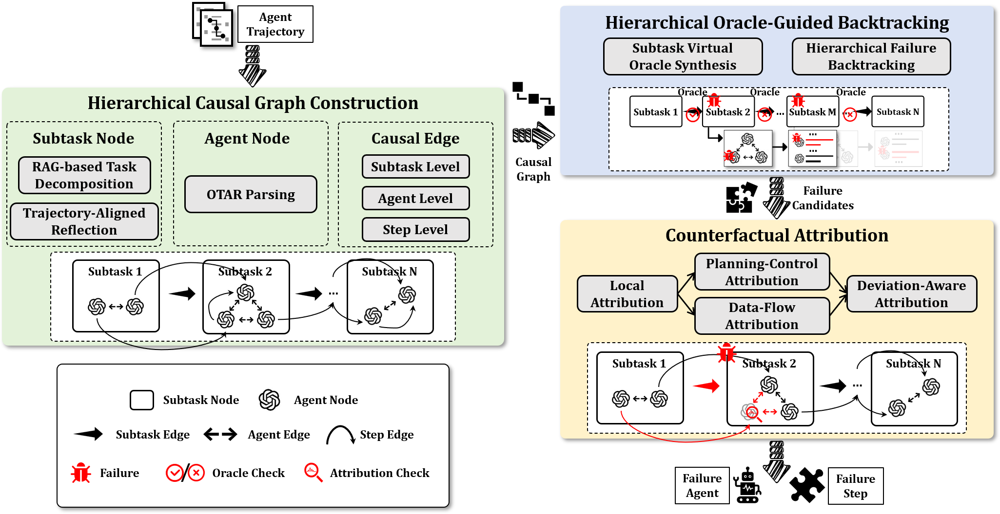

## 1. 项目介绍与概述

本项目是论文 **“From Flat Logs to Causal Graphs: Hierarchical Failure Attribution for LLM-based Multi-Agent Systems”** 的复现与工程化实现，核心目标是：当一个 **LLM 多智能体系统（MAS）** 在真实任务中失败时，自动定位“**谁（哪个 agent）在什么时候（哪一步）**”引入了决定性错误，并把它和“下游被连带带崩的症状”区分开来

### 背景：为什么 MAS 的失败很难“查真凶”

LLM 驱动的 MAS 很强，但也很脆：已有研究报告在复杂任务上失败率可高达 **86.7%**。更麻烦的是，失败往往沿着工具调用、环境反馈、agent 间通信、数据依赖一路传播，使得日志看起来像一坨“时间顺序的碎片”，很难直接读出因果链条。
 论文把诊断困难概括为三点：**因果流不透明**、**缺少中间监督（只有最终成败）**、**责任边界模糊（错误出现处 ≠ 错误引入处）**。

### CHIEF：把“平面日志”变成“可诊断结构”

为了解决上述问题，CHIEF 不再把日志当作扁平文本，而是把归因过程改造成一个 **结构化、可追溯的分治流程**：

- 先把混乱轨迹重建为 **分层因果图（Hierarchical Causal Graph, HCG）**；
- 再用 **分层的虚拟 oracle** 做自顶向下回溯，快速缩小嫌疑范围；
- 最后用 **反事实归因** 做因果筛查，严格区分根因与传播症状。

### 评测基准

论文在 **Who&When**（目前公开的 MAS failure attribution 基准）上评测：数据集包含 **184** 条失败日志，其中 **126** 条为算法生成子集（来自 CaptainAgent 的多样架构），**58** 条为手工子集（来自 Magnetic-One），并通过多轮专家共识标注保证 ground truth 可靠性。
 在该基准上，CHIEF 相比 8 个基线方法在 agent-level 与 step-level 归因准确率上整体更优。

------

## 2. 功能概述

### 2.1 总体流程



如图所示，CHIEF 将 failure attribution 拆成三个阶段：(1) 分层因果图构建；(2) 分层 oracle 引导回溯；(3) 反事实归因，用分治方式逐步定位根因。

### 2.2 核心能力

- **Hierarchical Causal Graph Construction（HCG 构建）**：将扁平轨迹解析为“子任务—agent—步骤”的结构，并显式建模步骤间数据依赖与交互关系，为后续诊断提供结构基础。
- **Hierarchical Oracle-Guided Backtracking（分层回溯）**：用“合成的虚拟 oracles”验证子任务/阶段正确性，替代逐步线性扫描，通过自顶向下搜索快速收敛到可疑错误节点。
- **Counterfactual Attribution（反事实归因）**：通过渐进式因果筛查（范围、依赖类型、可逆性等）来严格区分“真根因”与“传播症状”。

### 2.3 核心数据

> 表格格式：每个单元格为 **w/ 𝒢 / w/o 𝒢**，其中 **𝒢 表示可访问任务 ground truth（正确 outcome）**；FAMAS 仅报告 w/ 𝒢，因此缺失用 “–” 表示。

#### （A）主结果：Who&When 归因准确率（%）

| Type           | Method        | Hand-Crafted Agent ↑ | Hand-Crafted Step ↑ | Alg.-Generated Agent ↑ | Alg.-Generated Step ↑ |
| -------------- | ------------- | -------------------- | ------------------- | ---------------------- | --------------------- |
| Heuristic      | Random        | 12.00 / 12.00        | 4.20 / 4.20         | 29.10 / 29.10          | 19.10 / 19.10         |
| LLM Prompting  | All-at-Once   | 50.00 / 48.28        | 5.17 / 5.17         | 61.11 / 59.52          | 13.49 / 15.87         |
| LLM Prompting  | Step-by-Step  | 36.00 / 34.30        | 6.60 / 6.90         | 39.70 / 28.30          | 27.40 / 17.80         |
| LLM Prompting  | Binary Search | 51.70 / 36.20        | 6.90 / 6.90         | 44.10 / 30.10          | 24.00 / 16.60         |
| LLM Prompting  | ECHO          | 68.40 / 67.90        | 28.10 / 26.80       | 68.80 / 67.20          | 28.80 / 27.20         |
| Spectrum-based | FAMAS         | 62.07 / –            | 41.38 / –           | 55.56 / –              | 23.81 / –             |
| Fine-tuning    | AgenTracer    | 69.10 / 63.82        | 20.70 / 20.68       | 69.62 / 63.73          | 42.90 / 37.30         |
| Fine-tuning    | GraphTracer   | 74.91 / 69.74        | 28.63 / 27.97       | 76.64 / 67.42          | 49.97 / 44.35         |
| **Ours**       | **CHIEF**     | **77.59 / 72.41**    | **29.31 / 29.31**   | **76.80 / 68.80**      | **52.00 / 45.60**     |

#### （B）成本：平均 Token 消耗（w/ 𝒢，越低越好）

| Method        | Hand-Crafted ↓ | Alg.-Generated ↓ |
| ------------- | -------------- | ---------------- |
| All-at-Once   | 21,581         | 5,833            |
| Step-by-Step  | 87,720         | 6,533            |
| Binary Search | 34,659         | 5,226            |
| FAMAS         | 431,620        | 116,660          |
| ECHO          | 53,701         | 25,642           |
| **CHIEF**     | **55,085**     | **19,504**       |

## 3. 环境与依赖

### 3.1 Python 与依赖安装

- 建议 Python **3.10+**。
- 依赖已在 `requirements.txt` 固定版本：

```
pip install -r requirements.txt
```

> 说明：`sentence-transformers` 会间接拉取 `torch/transformers` 等大依赖；首次安装会比较重，属于正常现象。

### 3.2 API 配置（.env）

本项目使用 **OpenAI Python SDK（兼容 OpenAI-style Chat Completions）** 调用模型。你需要在 `CHIEF/.env` 中填写自己的配置：

```
OPENAI_BASE_URL = "你的URL"
OPENAI_API_KEY = "你的key"
```

### 3.3 RAG 资源准备（重要）

`CHIEF.py` 会在启动时加载 RAG 检索器，默认会读取当前目录下的 `./index` 与 `./kb`。
 仓库里已经提供了预构建资源，它们位于 `rag/index` 与 `rag/kb`。

------

## 4. 快速开始

### 4.1 运行 CHIEF 主流程

```
cd CHIEF
python CHIEF.py --data_dir data/Hand-Crafted --model deepseek-chat
```

你也可以切换到算法生成子集：

```
python CHIEF.py --data_dir data/Algorithm-Generated --model deepseek-chat
```

### 4.2 输出位置

运行结束后会在 `results/CHIEF/` 下生成：

- `results_CHIEF_<model>_<dataset>_<time>.jsonl`：逐样本结果（便于断点/排查）
- `results_CHIEF_<model>_<dataset>_<time>_summary.json`：汇总准确率与详细列表

### 4.3 调试模式提示

`CHIEF.py` 顶部默认是：

- `DEBUG_MODE = True`
- `DEBUG_SAMPLE_LIMIT = 1`

这意味着它默认**只跑 1 条样本**用来快速自检。你要跑完整数据集时，把 `DEBUG_MODE` 改成 `False`。

------

## 5. Baseline 模式

仓库当前提供的 baseline 脚本都在 `baseline_method/` 下，可直接复现对比（同样依赖 `.env` 的 API 配置）。

> 通用参数建议：
>
> - `--model`：模型名（如 `deepseek-chat / gpt-4o-mini / ...`）
> - `--data_dir`：数据目录（`data/Hand-Crafted` 或 `data/Algorithm-Generated`）

### 5.1 One-shot Baseline（最简单：直接让模型指出错误）

```
cd CHIEF
python baseline_method/baseline.py --model deepseek-chat --data_dir data/Hand-Crafted
```

输出默认在 `results/baseline/`。

### 5.2 All-at-Once

```
python baseline_method/allatonce.py --model deepseek-chat --data_dir data/Hand-Crafted
```

输出在 `results/v1/`。

### 5.3 Step-by-Step

```
python baseline_method/stepbystep.py --model deepseek-chat --data_dir data/Hand-Crafted
```

输出在 `results/stepbystep/`。

### 5.4 Binary Search

```
python baseline_method/binarysearch.py --model deepseek-chat --data_dir data/Hand-Crafted
```

输出在 `results/binarysearch/`。

------

## 6. 项目结构说明

```
CHIEF/
├─ CHIEF.py
├─ requirements.txt
├─ .env
├─ __init__.py
├─ baseline_method/
│  ├─ baseline.py
│  ├─ allatonce.py
│  ├─ stepbystep.py
│  └─ binarysearch.py
├─ rag/
│  ├─ rag_search.py
│  ├─ build_gaia_kb.py
│  ├─ build_assistantbench_kb_faiss.py
│  ├─ index/            # 已预构建的 FAISS 索引（供复制到项目根目录 ./index）
│  ├─ kb/               # 已预构建的知识库 JSON（供复制到项目根目录 ./kb）
│  └─ data/             # 构建 RAG 资源用的原始数据（一般无需动）
├─ data/                # Who&When 数据集（文件较多，README 不展开）
│  ├─ Algorithm-Generated/
│  └─ Hand-Crafted/
└─ results/             # 运行输出（可复现实验结果与日志）
   └─ CHIEF/
```

- `CHIEF.py`：主方法入口（CHIEF 模式），读取 `--data_dir` 下的样本并输出归因结果与汇总。
- `baseline_method/`：对比基线方法脚本（方便横向评测）。
- `rag/`：RAG 检索相关组件与资源（索引、KB、构建脚本）。
- `data/`：数据集目录（你已说明无需在 README 细讲，这里只标注用途）。
- `results/`：默认输出目录，按方法/脚本分子目录保存。